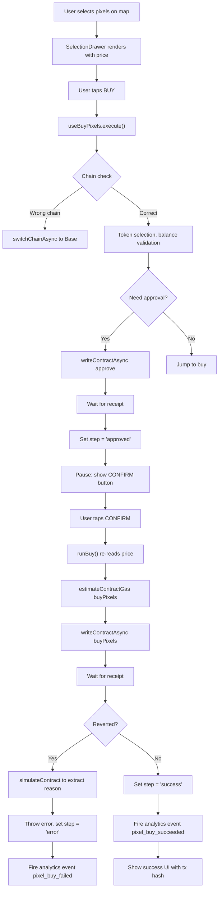

# Terreno Web App — Transaction Flow & Architecture Analysis

## Overview

The Terreno web app is a Next.js App Router application built on Base mainnet, running as a Nimiq Pay mini app. All transactions go through wagmi hooks with viem under the hood, using injected wallet connectors.

---

## 1. Transaction Entry Points

### Primary Transaction Hooks

#### **useBuyPixels** — Pixel Purchase Transactions
**Location**: [src/hooks/useBuyPixels.ts](src/hooks/useBuyPixels.ts)

**Transaction Flow**:
```
execute() 
  ├─ Chain validation (must be Base)
  ├─ Stablecoin selection (USDC/USDT, highest balance)
  ├─ Balance check & spend cap validation
  ├─ Approval phase (if needed)
  │   └─ approve(token, spender, amount)
  ├─ [PAUSE] 'approved' state awaits explicit user tap
  │   (Critical: Nimiq Pay requirement — no rapid-fire confirmations)
  └─ runBuy()
      ├─ Fresh price re-read (prices can move during pause)
      ├─ Gas estimation (with fallback ceiling)
      ├─ buyPixels(pixelIds[], token, maxCost, deadline)
      └─ Receipt confirmation & error recovery
```

**Contract Methods Called**:
- `approve(token: address, maxAmount: uint256)` — ERC-20 approval
- `buyPixels(ids: uint256[], token: address, maxCost: uint256, deadline: uint256)` — Purchase

**State Machine**:
```
idle → approving → [approved] → buying → confirming → success
                        ↓ (explicit tap)
                   [pause for player]
```

**Special Handling**:
- **Re-entrancy guard** (`inFlight` ref): prevents double-tap during renders
- **Price re-read between approval & confirm**: ensures deadline doesn't expire before broadcast
- **Spend cap** ($10 USD hardcoded, validated before wallet opens)
- **Slippage tolerance** (default 2%, configurable via `NEXT_PUBLIC_BUY_SLIPPAGE_BPS`)
- **Deadline window** (default 20min, configurable via `NEXT_PUBLIC_BUY_DEADLINE_SECONDS`)
- **Gas estimation fallback**: if estimate fails, uses ceiling `300k + (pixelCount * 80k)`
- **Builder Code attribution** (ERC-8021): 16-byte suffix appended to all writes (currently unset on Base)
- **Error classification**: wallet rejections vs. contract failures vs. gas failures (separate tracking)

**Integration Points**:
- Called from [src/app/page.tsx](src/app/page.tsx) line 161: `const buy = useBuyPixels(currentMapId)`
- UI component: [SelectionDrawer.tsx](src/components/Overlays/SelectionDrawer.tsx) renders buy dialog
- Progress tracking: [TxProgress.tsx](src/components/Overlays/TxProgress.tsx) shows real-time status

**Analytics Events**:
- `pixel_buy_started` — buy initiated, includes pixelCount, totalUsd, token, map
- `pixel_buy_succeeded` — tx mined, includes txHash
- `pixel_buy_failed` — tx failed/reverted, includes classified reason & category
- `pixel_buy_rejected` — user rejected wallet prompt
- `pixel_buy_blocked` — didn't reach wallet (reasons: not_connected, wrong_chain, no_stablecoin, over_cap, insufficient_funds)
- `pixel_buy_gas_fallback` — estimate failed, using ceiling (stage: approve/buy, level: estimate/ceiling)

---

#### **useProfile** — Profile Update Transactions
**Location**: [src/hooks/useProfile.ts](src/hooks/useProfile.ts)

**Transaction Flow**:
```
save() [imperative async]
  ├─ Chain validation & switch if needed
  ├─ Encode fields (name, color, URL)
  ├─ Gas estimation (or use 200k ceiling)
  ├─ updateProfile(colorHex: uint24, nameBytes: bytes, urlBytes: bytes)
  └─ Receipt confirmation & state update
```

**Contract Method**:
- `updateProfile(color: uint24, label: bytes, url: bytes)` — Update profile

**State Machine**:
```
idle → saving → confirming → saved
  ↓ (on error)
  → error (stays rendered until next attempt or clear)
```

**Special Handling**:
- **Re-entrancy guard** (`inFlight` ref): prevents double-tap during renders
- **Deterministic default color** per address (matches map renderer for consistency before save)
- **Local persistence** (`localStorage`): picked color saved immediately so map reflects choice before on-chain confirm
- **Name touch-tracking**: prevents chain data re-fetches from clobbering unsaved edits
- **Generation fallback**: if no saved name, generate username from address (deterministic)
- **Gas ceiling** (200k): reasonable for profile writes, never gas-less

**Integration Points**:
- Called from [src/app/page.tsx](src/app/page.tsx) line 162: `const profile = useProfile(addrStr, currentMapId)`
- Also called from [src/app/profile/page.tsx](src/app/profile/page.tsx) for dedicated profile page
- Used in [connect-button-interactive.tsx](src/components/connect-button-interactive.tsx) to display on-chain name

**Analytics Events**:
- `profile_saved` — save confirmed, includes hasUrl flag
- `profile_save_failed` — save failed, includes classified reason

---

### Secondary Hooks Using Transactions

#### **useStablecoinBalance** — Token Discovery & Balance Reads
**Location**: `src/hooks/useStablecoinBalance.ts`

- Reads accepted tokens on-chain via contract
- Tracks each token's balance, decimals, symbol
- Returns `preferred` (highest balance) for auto-selecting payment token
- Not a write, but critical for buy flow setup

#### **useReadClient** — Guaranteed Read Client
**Location**: `src/hooks/useReadClient.ts`

- Wraps wagmi's `usePublicClient()` with fallback viem client
- Ensures reads work even when wallet not connected
- Used for all gas estimates and price reads

---

## 2. App Structure & Configuration

### Core Architecture

**File**: [src/components/wallet-provider.tsx](src/components/wallet-provider.tsx)

**Three-Layer Provider Tree**:

1. **SSR-Safe Vanilla Wagmi** (always renders)
   - Works on server & client
   - No wagmi hooks throw outside provider
   - Child hooks return safe defaults until hydration
   - Uses injected connector (window.ethereum)

2. **Nimiq Pay Layer** (if detected)
   - Runs `eth_accounts` (read-only, no dialog)
   - Only triggers if wallet already authorized
   - Auto-connects silently for returning users
   - Keeps vanilla tree (no Privy needed)

3. **Privy Layer** (lazy-loaded for web)
   - Dynamic import in useEffect (post-hydration)
   - Tree swap happens once chunk resolves
   - Child components never unmount during swap
   - Provides wallet connector UI, social auth, Privy-specific hooks

**wagmiConfig Creation**:
```typescript
const wagmiConfig = createConfig({
  chains: [base, baseSepolia],
  connectors: [injected()],
  ssr: true,  // Critical: fixes Next.js hydration mismatches
  transports: {
    [base.id]: baseTransport,
    [baseSepolia.id]: baseSepoliaTransport,
  },
})
```

**Key Design Decisions**:
- `ssr: true` prevents wagmi auto-reconnect on first client render (would trigger hydration mismatch #418)
- `injected()` connector works with both MiniPay's `window.ethereum` and browser wallets
- Privy NOT imported during SSR → prevents `useWallets` throws on build
- Dynamic Privy import → child tree stays mounted during provider swap (prevents race condition that crashed Vercel deploys in #221)

**Root Layout**: [src/app/layout.tsx](src/app/layout.tsx)
```
WalletProvider
  └─ PostHogProvider (analytics)
      └─ CurrentMapProvider (map state)
          └─ RevealsProvider (revealed map ids)
              └─ RewardAnnouncement (UI)
                  └─ QueryClientProvider (react-query)
```

### Contract Configuration

**File**: [src/lib/maps/contracts.ts](src/lib/maps/contracts.ts)

**Multi-Map Registry**:
- World map (id: 0, 170×100 pixels)
- 7 continents (ids: 1–7, varying dimensions)
- Each has its own deployed Terreno.sol contract instance
- Per-map configuration: address, dimensions, display name, slug

**Registry Structure**:
```typescript
interface MapContract {
  id: MapId
  slug: MapSlug ('world' | 'africa' | 'europe' | 'asia' | ...)
  displayName: string
  address: `0x${string}`
  chainId: ChainId (base.id or baseSepolia.id)
  width: number
  height: number
  revealed: boolean
}
```

**Map Visibility Rollout**:
1. Runtime override: Edge Config key `revealedMapIds` (admin-controlled via /api/reveals)
2. Deploy-time: `NEXT_PUBLIC_REVEALED_MAP_IDS` env var (comma-separated ids, e.g. "0,1,2")
3. Static fallback: `revealed: false` flags in registry (WORLD only by default)

**Helper Functions**:
- `getContractByMapId(id)` — Returns address for a map (used everywhere before writes)
- `getMapsForChain(chainId)` — Returns revealed maps on a specific chain (filters undeployed)
- `isDeployed(mapId)` — Checks if map address is not sentinel (0x0000...)
- `assertDeployed(mapId)` — Throws if trying to write to undeployed contract

**Contract Address Overrides**:
Env var `NEXT_PUBLIC_MAP_ADDRESS_OVERRIDES` (format: "id:0xabc...,id2:0xdef...")
- Used for QA/preview deploys to test contracts before promotion
- Grid dimensions still come from registry (use override for contracts with matching grid)

### Contract ABIs & Interface

**File**: [src/lib/contract.ts](src/lib/contract.ts) *(auto-generated)*

**Generation**:
```bash
cd apps/contracts && uv run python3 script/export-abi.py
```

**Exports**:
- `TERRENO_ABI` — Full interface (write & read functions, events, errors)
- `ERC20_ABI` — Standard ERC-20 for approvals

**Key Terreno Functions**:
```solidity
// Reads
function selectionPrice(uint256[] ids) returns (uint256)
function profiles(address owner) returns (uint24 color, bytes label, bytes url)
function getAcceptedTokens() returns (IERC20[])
function PRICE_DECIMALS() returns (uint8)
function HALVING_TIME() returns (uint256)
function LAND_MASK_LENGTH() returns (uint256)
function TOTAL_PIXELS() returns (uint256)

// Writes
function buyPixels(uint256[] ids, address token, uint256 maxCost, uint256 deadline)
function updateProfile(uint24 color, bytes label, bytes url)
function approve(address token) // inherited from AccessControl
```

### Chain Configuration

**File**: [src/lib/chain.ts](src/lib/chain.ts)

**Supported Networks**:
- **Base Mainnet** (id: 8453) — Production
  - RPC: Alchemy default via viem
  - Blocks: EIP-4844 blobs (OP-Stack)
  - Finality: ~1 min

- **Base Sepolia** (id: 84532) — Testnet
  - Block explorer: BaseScan Sepolia
  - Faucet: Coinbase Developer Platform

**Transport Configuration**:
```typescript
const baseTransport = http('https://base-mainnet.g.alchemy.com/v2/...')
const baseSepoliaTransport = http('https://base-sepolia.g.alchemy.com/v2/...')
```

---

## 3. Environment Variable Patterns

### Transaction Tuning

| Env Var | Default | Format | Purpose |
|---------|---------|--------|---------|
| `NEXT_PUBLIC_BUY_SLIPPAGE_BPS` | 200 | uint | Buy slippage tolerance in basis points (2%) |
| `NEXT_PUBLIC_BUY_DEADLINE_SECONDS` | 1200 | uint | Buy tx valid window in seconds (20 min) |
| `NEXT_PUBLIC_MAP_THRESHOLD_USD` | 2 | float | Avg pixel price before advancing active map |
| `NEXT_PUBLIC_MAP_ADDRESS_OVERRIDES` | unset | CSV | Override contract addresses for QA (id:0xabc,id2:0xdef) |
| `NEXT_PUBLIC_REVEALED_MAP_IDS` | unset | CSV | Phased rollout; reveals which maps (e.g. "0,1,2") |

### Builder Code Attribution

| Env Var | Default | Purpose |
|---------|---------|---------|
| `NEXT_PUBLIC_BUILDER_CODE` | unset on Base | ERC-8021 app identifier (16-byte hex) |

**Note**: Currently UNSET on Base because the previous chain's attribution indexer doesn't read Base, and the calldata cost (~672 gas) is significant on OP-Stack. Set to a value if Base indexing starts.

### Example `.env.local`:
```bash
NEXT_PUBLIC_BUY_SLIPPAGE_BPS=200
NEXT_PUBLIC_BUY_DEADLINE_SECONDS=1200
NEXT_PUBLIC_MAP_THRESHOLD_USD=2.00
NEXT_PUBLIC_REVEALED_MAP_IDS=0,1,2
NEXT_PUBLIC_MAP_ADDRESS_OVERRIDES=1:0x2E7F1c57db241D529f7BD6B1fA8229984267Af23
```

---

## 4. Wallet & Provider Setup

### Connector Hierarchy

**Injected Connector** (`wagmi/connectors`)
- Primary connector for both MiniPay & web
- Reads `window.ethereum` (injected by host)
- Auto-connect disabled (gated by `eth_accounts` check in NimiqPayAutoConnect)

**Privy Connectors** (`@privy-io/wagmi`, web only)
- Social auth (Google, Discord, Twitter)
- Embedded wallets
- External wallet connections (MetaMask, Phantom, Coinbase Wallet)
- Only loaded post-hydration for non-MiniPay clients

### Transaction Execution Pattern

All writes follow this pattern:

```typescript
const { writeContractAsync } = useWriteContract()  // wagmi hook

const txHash = await writeContractAsync({
  address: contractAddress,
  abi: TERRENO_ABI,
  functionName: 'buyPixels',
  args: [bigIds, tokenAddress, maxCost, deadline],
  
  // Always pass explicit gas (prevents viem from asking host wallet to estimate)
  gas: estimatedGas,
  
  // ERC-8021 builder code suffix (currently unset on Base)
  dataSuffix: BUILDER_CODE_DATA_SUFFIX,
})

// Wait for receipt
const receipt = await publicClient.waitForTransactionReceipt({ hash: txHash })

if (receipt.status === 'reverted') {
  // Re-simulate to extract failure reason
  try {
    await publicClient.simulateContract({ ... })
  } catch (simErr) {
    throw new Error('Transaction reverted: ' + simErr.message)
  }
}
```

### Gas Estimation Pattern

```typescript
// Estimate with same suffix that broadcast will use
const gas = await publicClient.estimateContractGas({
  address: contractAddress,
  abi: TERRENO_ABI,
  functionName: 'buyPixels',
  args: [...],
  account: address,
  dataSuffix: BUILDER_CODE_DATA_SUFFIX,  // MUST MATCH BROADCAST
})

// Add 20% buffer for price movement
const safeGas = (gas * 12n) / 10n

// Fallback if estimate fails
if (!gas) {
  console.warn('Gas estimate failed; using ceiling')
  gas = 300_000n + BigInt(pixelCount) * 80_000n
}
```

### State Management

**Wagmi State** (via hooks):
- `useAccount()` — Connected address, chainId, isConnected
- `usePublicClient()` — Read-only client (fallback to viem if null)
- `useSwitchChain()` — Prompt chain switch
- `useWriteContract()` — Send transactions
- `useReadContract()` — Read contract state

**Local State** (in hooks):
- Buy flow: `step`, `error`, `txHash`, `insufficientBalance`, `inFlightRef`
- Profile: `name`, `color`, `url`, `saveState`, `error`, `inFlightRef`, `nameTouchedRef`
- Balance: `preferred` token, `totalAmount`, `isLoading`

**Component State** (in main page):
- Map data (`pixelDataRef`, `loadState`, `version`, `changedIds`, `priceConfig`)
- Selection (`selectedIds`, `pixelCount`, `limitBump`)
- UI (`activeOverlay`, `mapView`, `currentScale`, `tappedPixelId`)

---

## 5. Error Handling & Classification

### Buy Error Classification

**File**: [src/lib/buyErrors.ts](src/lib/buyErrors.ts)

**Error Categories**:
1. **UserRejected** — Wallet rejection (user chose "Cancel")
   - Event: `pixel_buy_rejected`
   - UI: Silent, button re-enables

2. **InsufficientBalance** — Wallet lacks funds
   - Event: `pixel_buy_failed` with `category: 'insufficient_balance'`
   - UI: "Insufficient balance" error under pixel list

3. **PriceMoved** — Price exceeded `maxCost` while waiting
   - Event: `pixel_buy_failed` with `category: 'price_moved'`
   - UI: "Price moved. Try again?"

4. **DeadlineExpired** — Tx took >20min to mine
   - Event: `pixel_buy_failed` with `category: 'deadline_expired'`
   - UI: "Your transaction took too long"

5. **ContractRevert** — Contract logic failure (land occupied, etc.)
   - Event: `pixel_buy_failed` with `category: 'contract_revert'`
   - UI: "Transaction reverted on-chain" + simulated revert reason

6. **GasEstimateFailed** — Could not calculate gas
   - Event: `pixel_buy_gas_fallback`
   - Behavior: Use ceiling, continue (wallet may still reject)

7. **Unknown** — Uncategorized failure
   - Event: `pixel_buy_failed` with `category: 'unknown'` + truncated detail
   - UI: "Transaction failed" + raw error (first 100 chars)

### Error Extraction

```typescript
// viem masks provider errors as "An unknown RPC error occurred"
// Unwrap the real reason from .cause/.details/.data
function extractErrorDetail(e: unknown): string {
  return (
    e?.cause?.cause?.details ||
    e?.cause?.data?.message ||
    e?.cause?.shortMessage ||
    e?.shortMessage ||
    'Transaction failed'
  )
}
```

---

## 6. Analytics Event Map

### Buy Flow Events

```
user_connects_wallet
  ├─ wallet_connected { address, displayName }
  │
  └─ referral_landed { ref, mapId } [if deep-linked]
      │
      ├─ pixel_buy_blocked { reason, pixelCount, totalUsd, token, ref }
      │   (reasons: not_connected, wrong_chain, no_stablecoin, over_cap, insufficient_funds)
      │
      ├─ pixel_buy_started { pixelCount, totalUsd, token, mapId, ref }
      │   ├─ pixel_buy_succeeded { txHash }
      │   └─ pixel_buy_failed { reason, category, detail }
      │   └─ pixel_buy_rejected
      │   └─ pixel_buy_gas_fallback { stage, level, detail }
      │
      └─ checkout_insufficient_funds / checkout_split_currency_blocked
          (fires once per drawer-open when prices settled)
```

### Profile Flow Events

```
profile_saved { hasUrl }
  └─ profile_save_failed { reason, category, detail }
```

### Other Events

```
referral_landed { ref, mapId }
wallet_connected { address, displayName }
```

---

## 7. Key Files Reference

### Transaction Hooks
- [useBuyPixels.ts](src/hooks/useBuyPixels.ts) (350+ lines, full buy flow)
- [useProfile.ts](src/hooks/useProfile.ts) (200+ lines, profile updates)
- [useStablecoinBalance.ts](src/hooks/useStablecoinBalance.ts) (token discovery)
- [useReadClient.ts](src/hooks/useReadClient.ts) (fallback read client)

### UI Components
- [SelectionDrawer.tsx](src/components/Overlays/SelectionDrawer.tsx) (buy confirmation UI)
- [TxProgress.tsx](src/components/Overlays/TxProgress.tsx) (transaction progress indicator)
- [PixelInfoPanel.tsx](src/components/Overlays/PixelInfoPanel.tsx) (single-pixel info + buy button)
- [wallet-provider.tsx](src/components/wallet-provider.tsx) (wagmi + Privy setup)
- [connect-button.tsx](src/components/connect-button.tsx) (wallet connect UI)
- [connect-button-interactive.tsx](src/components/connect-button-interactive.tsx) (connected state)

### Configuration & Libraries
- [lib/maps/contracts.ts](src/lib/maps/contracts.ts) (contract registry)
- [lib/contract.ts](src/lib/contract.ts) (ABIs, auto-generated)
- [lib/chain.ts](src/lib/chain.ts) (network config)
- [lib/buyErrors.ts](src/lib/buyErrors.ts) (error classification)
- [lib/buyLimits.ts](src/lib/buyLimits.ts) (spend caps, slippage)
- [lib/attribution.ts](src/lib/attribution.ts) (ERC-8021 builder code)
- [lib/analytics.ts](src/lib/analytics.ts) (event tracking)

### Main Pages
- [app/page.tsx](src/app/page.tsx) (map UI, 500+ lines)
- [app/profile/page.tsx](src/app/profile/page.tsx) (profile editing)
- [app/layout.tsx](src/app/layout.tsx) (root layout, providers)

---

## 8. Transaction Safety & Guards

| Guard | Where | Prevents |
|-------|-------|----------|
| Chain check | `execute()` in useBuyPixels | Sending tx on wrong network |
| Re-entrancy (`inFlight` ref) | useBuyPixels, useProfile | Double-tap during renders |
| Balance check | SelectionDrawer + useBuyPixels | Spending more than available |
| Spend cap | useBuyPixels.execute() | Exceeding $10 USD limit |
| Slippage limit | runBuy() | Price moving >2% between quote & broadcast |
| Deadline window | runBuy() | Tx staying in mempool >20min |
| Gas estimate fallback | runBuy(), approve() | Gas-less sends to host wallet |
| Revert simulation | runBuy() receipt | Extracting failure reason from reverted tx |
| Implicit re-read | runBuy() | Using stale price/deadline from approval pause |

---

## Summary: Data Flow for a Single Pixel Buy



---

## Quick Facts

- **Primary transaction hook**: `useBuyPixels` (~350 lines, full approval + buy flow)
- **Profile transaction hook**: `useProfile` (~200 lines, async save with receipt tracking)
- **Wagmi version**: ^2.22.1 (constrained by Privy's @privy-io/wagmi compatibility)
- **viem version**: 2.47.4+ (required for dataSuffix parameter)
- **Chains supported**: Base Mainnet + Base Sepolia (testnet)
- **Stablecoins**: USDC, USDT (auto-discovered, user highest-balance token selected)
- **Contract pattern**: UUPS proxy on Base, one per map (world + 7 continents)
- **Network timeout**: 20 minutes (deadline window for buy transactions)
- **Spend cap**: $10 USD per buy (blocking check before wallet opens)
- **Slippage**: 2% default (configurable via env var)
- **Gas estimation**: Always passed explicitly (prevents host wallet estimation hangs in MiniPay)
- **Builder code**: ERC-8021 suffix currently unset (no Base indexing yet)
